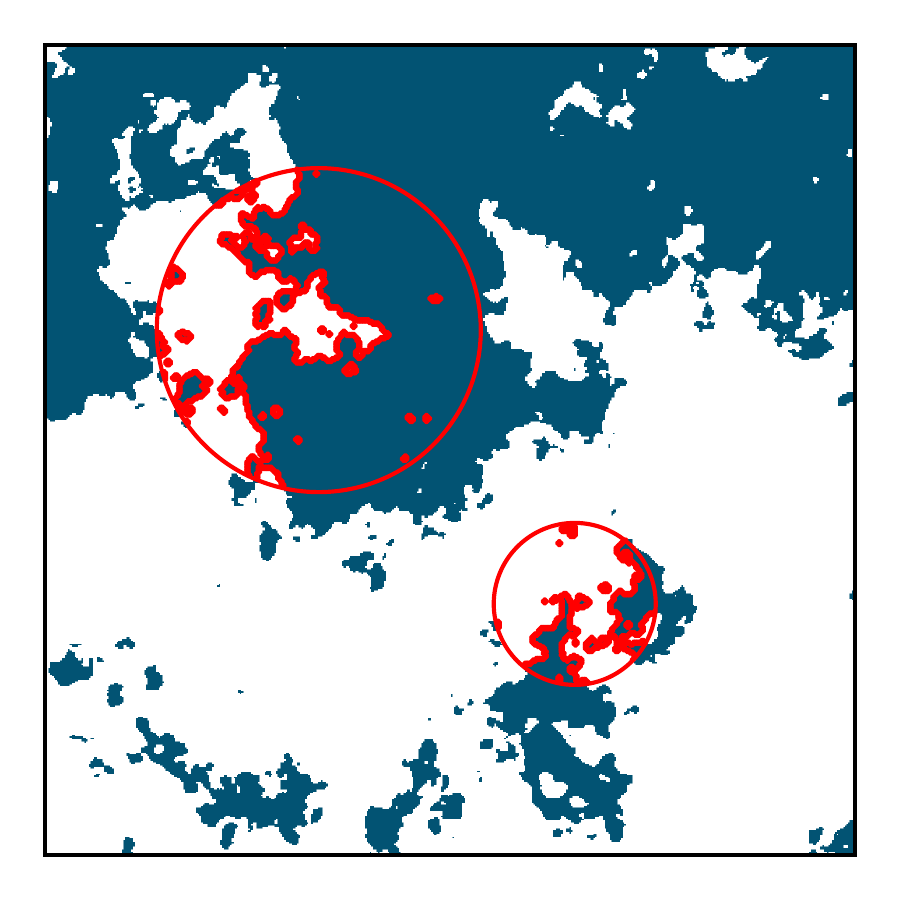

*Figure from DeWitt et al. (2026)*

# objscale

Object-based analysis functions for fractal dimensions and size distributions in atmospheric sciences and beyond. Optimized for large datasets.

fhdjsk

## Description

`objscale` provides computational tools for analyzing the scaling properties of objects in 2D binary arrays. The package consolidates methods for calculating size distributions and fractal dimensions that account for finite domain effects and complex boundary conditions. Originally developed for atmospheric science applications, these methods apply broadly to any field where object scaling properties matter.

The package implements methods from two main papers:

- [DeWitt & Garrett (2024)](https://acp.copernicus.org/articles/24/8457/2024/acp-24-8457-2024.html) - finite domain effects in size distributions  
- [DeWitt et al. (2026)](https://acp.copernicus.org/articles/26/6951/2026/) - toward less subjective metrics for quantifying the shape and organization of clouds

See the [interactive scaling explorer](https://thomasddewitt.com/visuals-and-tools/scaling-explorer/index.html) to visualize how the correlation dimension is computed.

## Key Functions

### `finite_array_powerlaw_exponent`

Calculate power-law exponents for size distributions while accounting for finite domain truncation effects. Essential for accurate scaling analysis in bounded domains.

### `individual_fractal_dimension`

Fractal dimension of individual objects using the perimeter-area relationship, with proper handling of interior holes and resolution effects.

### `individual_correlation_dimension`

Correlation dimension of a single object. Isolates the Nth largest structure in an array (after removing border-touching structures) and computes its correlation dimension.

### `ensemble_correlation_dimension`

Correlation dimension for characterizing the collective scaling properties of object ensembles. Uses point-pair correlation analysis across multiple length scales.

### `ensemble_box_dimension`

Box-counting dimension for object ensembles. New analyses should prefer `ensemble_correlation_dimension`. Counts boxes containing object boundaries at varying spatial scales.

## Installation

```bash
pip install objscale
```

## Documentation

📖 **[Full Documentation](https://objscale.readthedocs.io)**

Complete API reference, detailed examples, and usage guides are available at [objscale.readthedocs.io](https://objscale.readthedocs.io).

## Agent Skill (Highly Recommended for Agents)

An agent skill ships inside the pip package, so it always matches the installed version. After `pip install objscale`, install it for Claude Code:

```bash
python -c "import objscale; objscale.install_agent_skill('claude')"
```

Codex:

```bash
python -c "import objscale; objscale.install_agent_skill('codex')"
```

For other agent frameworks, copy the skill file manually from the path given by `objscale.skill_path()`.

## Quick Example

```python
import objscale
import numpy as np

# Create binary array (e.g., cloud mask, percolation lattice)
arrays = [(np.random.random((1000, 1000)) < 0.3).astype(int) for _ in range(4)]

# Size distribution with finite domain corrections
exponent, (log10_sizes, log10_counts) = objscale.finite_array_powerlaw_exponent(
    arrays, 'area', return_counts=True
)

# Ensemble fractal dimensions
corr_dim = objscale.ensemble_correlation_dimension(arrays)
box_dim = objscale.ensemble_box_dimension(arrays)

# Individual object analysis  
ind_dim = objscale.individual_fractal_dimension(arrays)
```

### A note on uncertainty

As of v2.0.0, exponent and dimension estimators return point estimates only. Earlier versions returned uncertainties computed as 2× the OLS standard error of the regression slope, but these assume statistically independent data points. Points on a scaling function computed from a fractal or multifractal field are strongly correlated across scales, so those uncertainties were badly miscalibrated ([demonstration here](https://thomasddewitt.com/thought-cloud/too-many-exponents/index.html)). If you need uncertainty estimates, bootstrap across statistically independent images instead. `linear_regression` still returns its error estimates, which are valid for independent data only.

## Features

- **Finite domain corrections**: Proper handling of truncation effects at domain boundaries as recommended by [DeWitt & Garrett (2024)](https://acp.copernicus.org/articles/24/8457/2024/acp-24-8457-2024.html)
- **Multiple size metrics**: Area, perimeter, width, height, nested perimeter
- **Arbitrary boundaries**: Support for NaN-demarcated non-rectangular domains  
- **Individual and Ensemble methods**: Characterize both individual and collective properties of object fields
- **Performance optimized**: Numba acceleration for computational efficiency. Can handle billions of individual objects on a mid-range laptop.

## Requirements

- Python ≥ 3.8
- NumPy ≥ 1.20.0
- SciPy ≥ 1.7.0  
- scikit-image ≥ 0.18.0
- Numba ≥ 0.56.0

## Available Functions

### Fractal Dimensions

- `individual_fractal_dimension` - Fractal dimension of individual objects (perimeter-area scaling)
- `individual_correlation_dimension` - Correlation dimension of a single object
- `ensemble_correlation_dimension` - Correlation dimension for object ensembles
- `ensemble_box_dimension` - Box-counting dimension for object ensembles

### Size Distributions

- `finite_array_powerlaw_exponent` - Power-law exponents with finite domain corrections
- `finite_array_size_distribution` - Size distributions with truncation analysis
- `array_size_distribution` - Basic size distribution for single arrays

### Object Analysis

- `label_structures` - Label connected components (wraps scipy.ndimage.label with NaN handling and periodic boundaries)
- `get_structure_areas` - Calculate areas of labelled structures (O(n), fast)
- `get_structure_perimeters` - Calculate perimeters of labelled structures (O(n), fast)
- `get_structure_height_width` - Calculate height and width of labelled structures
- `get_structure_props` - Calculate perimeter, area, width, height from a binary array (convenience wrapper)
- `get_every_boundary_perimeter` - Perimeters of every boundary including nested holes
- `total_perimeter` - Total perimeter of all objects
- `total_number` - Count number of structures
- `isolate_nth_largest_structure` - Extract the Nth largest connected structure
- `remove_structures_touching_border_nan` - Remove border-touching structures
- `remove_structure_holes` - Fill holes in structures
- `label_size` - Label each structure with its size value
- `clear_border_adjacent` - Clear structures touching array edges

### Utilities

- `coarsen_array` - Coarsen array resolution by averaging
- `linear_regression` - Linear regression with error estimates
- `encase_in_value` - Add border of specified value around array
- `get_coords_of_boundaries` - Find boundary pixel coordinates (toroidal topology)
- `get_locations_from_pixel_sizes` - Convert pixel size arrays to cumulative locations
- `set_num_threads` - Set number of threads for parallel computations

For detailed parameter descriptions and usage examples, see the [full documentation](https://objscale.readthedocs.io) or use `help(objscale.function_name)` or `objscale.function_name?` in IPython/Jupyter.

## Support Statement

This package consolidates research code developed over several years. While functional and tested, it should be considered research software with limited ongoing support. Users are encouraged to understand the underlying methods through the referenced papers before applying to their data.

## References

If you use this package, please cite:

DeWitt, T. D. and Garrett, T. J.: Finite domains cause bias in measured and modeled 
distributions of cloud sizes, Atmos. Chem. Phys., 24, 8457–8472, 
https://doi.org/10.5194/acp-24-8457-2024, 2024.

DeWitt, T. D., Garrett, T. J., and Rees, K. N.: Toward less subjective metrics for 
quantifying the shape and organization of clouds, Atmos. Chem. Phys., 26, 6951–6971, 
https://doi.org/10.5194/acp-26-6951-2026, 2026.

## Author

Thomas D. DeWitt
University of Utah Department of Atmospheric Sciences

Sonnet 4 with Claude Code
Anthropic

## License

MIT License
